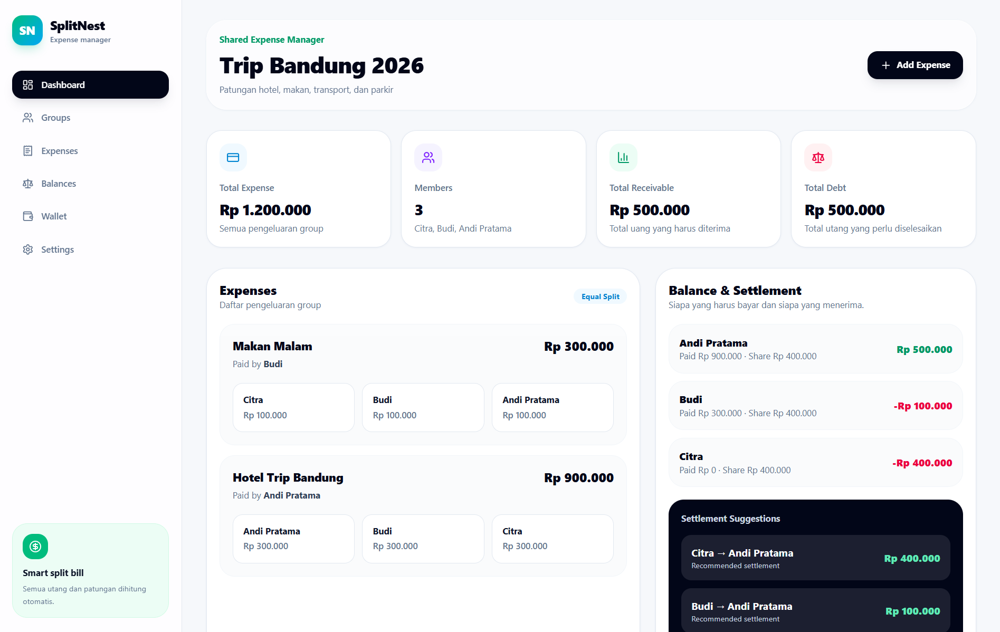

# SplitNest

SplitNest is a shared expense manager that helps groups track shared bills, split expenses fairly, and calculate who owes whom.

This project was built as a full-stack portfolio project using Go, MySQL, React, TypeScript, and Tailwind CSS.

## Preview

### Dashboard



## Overview

Managing shared expenses can be messy, especially during trips, house sharing, small events, or group activities. People often forget who paid first, how much each person should pay, and whether a payment has already been settled.

SplitNest solves this problem by providing a simple dashboard to record expenses, split bills automatically, and show balance calculations clearly.

## Features

- Group management
- Member management
- Add shared expenses
- Equal split bill calculation
- Automatic balance calculation
- Settlement suggestions
- Modern dashboard UI
- React frontend connected to Go REST API

## Tech Stack

### Backend

- Go
- Chi Router
- MySQL
- REST API

### Frontend

- React
- TypeScript
- Vite
- Tailwind CSS
- Lucide React Icons

## Project Structure

```text
splitnest/
├── backend/
│   ├── internal/
│   │   ├── config/
│   │   ├── database/
│   │   ├── handlers/
│   │   ├── models/
│   │   └── routes/
│   ├── main.go
│   └── go.mod
│
├── frontend/
│   ├── src/
│   ├── package.json
│   └── vite.config.ts
│
├── docs/
│   └── images/
│       └── dashboard.png
│
└── README.md
```

## Local Setup

### 1. Clone the repository

```bash
git clone https://github.com/briann477/splitnest.git
cd splitnest
```

### 2. Backend setup

Go to the backend folder:

```bash
cd backend
go mod tidy
```

Create a `.env` file inside the `backend` folder:

```env
APP_PORT=8080

DB_HOST=127.0.0.1
DB_PORT=3306
DB_NAME=splitnest
DB_USER=root
DB_PASSWORD=
```

Run the backend server:

```bash
go run main.go
```

The backend will run on:

```text
http://localhost:8080
```

### 3. Frontend setup

Open another terminal and go to the frontend folder:

```bash
cd frontend
npm install
npm run dev
```

The frontend will run on:

```text
http://localhost:5173
```

## API Endpoints

### Health Check

```http
GET /api/health
```

### Groups

```http
GET    /api/groups
POST   /api/groups
GET    /api/groups/{id}
PUT    /api/groups/{id}
DELETE /api/groups/{id}
```

### Members

```http
GET    /api/groups/{groupID}/members
POST   /api/groups/{groupID}/members
GET    /api/members/{id}
PUT    /api/members/{id}
DELETE /api/members/{id}
```

### Expenses

```http
GET  /api/groups/{groupID}/expenses
POST /api/groups/{groupID}/expenses
```

### Balances

```http
GET /api/groups/{groupID}/balances
```

## Current MVP Status

The current MVP supports:

- Creating groups
- Adding members
- Adding shared expenses
- Equal split calculation
- Balance calculation
- Settlement suggestions
- Frontend dashboard with live API data

## Roadmap

- Mark settlement as paid
- Expense categories
- Filter and search
- Login and user account
- Receipt upload
- Export report
- Responsive mobile polish

## Author

Built by [briann477](https://github.com/briann477).
